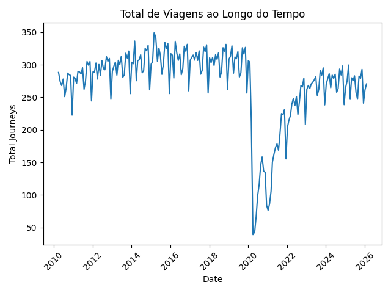

# 🚇 Pipeline de Dados de Transporte de Londres

## 📌 Visão Geral do Projeto
Este projeto implementa um pipeline completo de **ETL (Extract, Transform, Load)** utilizando dados reais de transporte público de Londres.

O objetivo é processar dados brutos, armazená-los em um banco de dados relacional e gerar insights relevantes por meio de consultas SQL e visualizações com Python.

---

## ⚙️ Tecnologias Utilizadas

- Python
- Pandas
- MySQL
- Matplotlib
- SQL

---

## 🏗️ Estrutura do Projeto

EtlTransportes_Londres/

│  
├── data/              # Dataset bruto  
├── etl/  
│   ├── extract.py     # Extração dos dados  
│   ├── transform.py   # Limpeza e transformação  
│   └── load.py        # Carga no MySQL  
│  
├── analysis/  
│   └── analysis.py    # Análise e visualização  
│  
├── sql/  
│   ├── analysis.sql   # Consultas exploratórias  
│   └── queries.sql    # Consultas de negócio  
│  
├── outputs/           # Gráficos gerados  
├── README.md  

---

## 🔄 Pipeline ETL

### 🟢 Extract (Extração)
- Leitura do arquivo CSV utilizando Pandas

### 🟡 Transform (Transformação)
- Padronização dos nomes das colunas  
- Conversão de tipos de dados (datas, inteiros e floats)  
- Tratamento de valores inválidos  
- Criação da coluna `total_journeys`  

### 🔵 Load (Carga)
- Criação do banco de dados no MySQL  
- Criação da tabela  
- Inserção dos dados tratados  
- Validação dos dados via consultas SQL  

---

## 📊 Análise de Dados

O projeto inclui análises utilizando SQL e Python:

### 📌 SQL
- Agregações por período  
- Comparação entre modais de transporte  
- Identificação de períodos com maior e menor uso  

### 📌 Python
- Estatísticas descritivas  
- Análise temporal  
- Distribuição de uso por tipo de transporte  

---

## 📈 Visualização de Dados

Utilizando Matplotlib:

- Evolução do total de viagens ao longo do tempo  
- Comparação entre os tipos de transporte  

Exemplo de gráfico gerado:

---

## 💡 Principais Insights

- 🚌 O ônibus é o meio de transporte mais utilizado ao longo do período analisado  
- 🚇 O metrô (Underground) é o segundo mais utilizado  
- 📉 Existem quedas significativas no volume de viagens, indicando possíveis impactos externos  
- 📈 O uso do transporte varia ao longo do tempo, sugerindo padrões sazonais  

---

## 🚀 Como Executar o Projeto

### 1. Clonar o repositório
git clone <url-do-repositorio>
cd EtlTransportes_Londres

### 2. Criar ambiente virtual
python -m venv venv
source venv/bin/activate

### 3. Instalar dependências
pip install -r requirements.txt

### 4. Executar o pipeline ETL
python etl/load.py

### 5. Executar análise
python analysis/analysis.py

---

## 📌 Possíveis Melhorias Futuras

- Automatização do pipeline (Airflow)  
- Criação de dashboard interativo (Streamlit)  
- Integração com Data Warehouse (BigQuery, Snowflake)  
- Melhorias na validação e qualidade dos dados  

---

## 👨‍💻 Autor

Desenvolvido por Diogo Barroso
